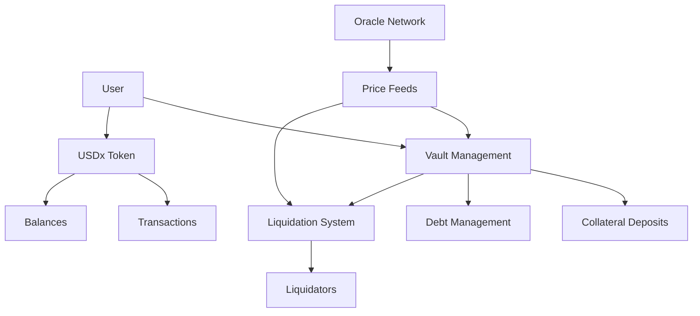
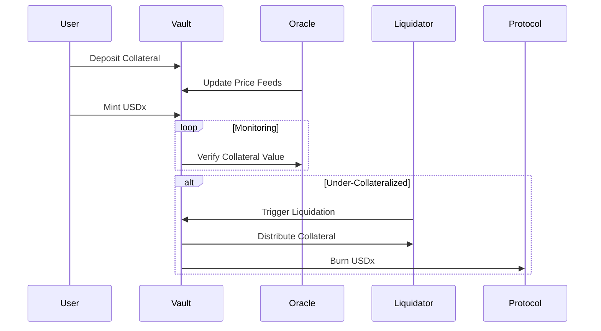

# BitBridge Protocol

BitBridge is a decentralized multi-collateral stablecoin protocol built on the Stacks blockchain, enabling users to mint a USD-pegged stablecoin (USDx) using Bitcoin (via xBTC) and STX as collateral. The protocol combines Bitcoin's security with smart contract flexibility to create a robust DeFi primitive for trustless stablecoin operations.

## Key Features

- Dual collateral support (STX and xBTC)
- Configurable risk parameters
- Decentralized price oracle system
- Automated liquidation engine
- SIP-010 compliant stablecoin
- Real-time collateral health monitoring

## Architecture Overview



### Core Components

1. **Vault Management**
   - Create/manage collateralized debt positions
   - Supports STX and xBTC collateral combinations
   - Dynamic debt calculations with stability fees
   - Collateral ratio monitoring

2. **Oracle System**
   - Decentralized price feeds
   - Time-bound price validity
   - Confidence interval reporting
   - Operator-managed updates

3. **Liquidation Engine**
   - Permissioned liquidator network
   - Automatic undercollateralization detection
   - Penalized liquidation process
   - Collateral redistribution

4. **USDx Token**
   - Fully collateralized stablecoin
   - SIP-010 compliant interface
   - Transparent mint/burn mechanics
   - Wallet-integration ready

5. **Risk Parameters**

   ```clarity
   LIQUIDATION_RATIO = 150%   // Minimum collateralization threshold
   MIN_COLLATERAL_RATIO = 200% // Required for new debt positions
   LIQUIDATION_PENALTY = 10%  // Applied during liquidations
   STABILITY_FEE = 2% APR     // Annual debt accrual
   ```

## Workflow Diagram



## Security Model

### Key Mechanisms

- **Collateral Buffers**: 200% minimum initial ratio
- **Price Safeguards**:
  - Time-bound price validity (1 hour)
  - Confidence interval thresholds
  - Multi-oracle failover capability
- **Liquidation Protections**:
  - Permissioned liquidator network
  - Penalty-based liquidation incentives
  - Partial collateral liquidation

### Audit Considerations

1. Oracle price feed reliability
2. Collateral ratio calculation accuracy
3. Liquidation incentive alignment
4. Reentrancy protection
5. Arithmetic operation safety

## Integration Guide

### Basic Interactions

**Create Vault & Mint USDx**

```clarity
(create-vault u5000000 u100000) // 5 STX, 0.001 xBTC
(mint-usdx 1 u1000000)         // Mint 1 USDx
```

**Check Vault Health**

```clarity
(calculate-health-factor 1) => ok u250 // 250% collateralization
```

**Liquidate Vault (Operator)**

```clarity
(liquidate-vault 1) // Requires 100% debt coverage
```

### USDx Token Interface

```clarity
;; SIP-010 Standard
(transfer amount sender recipient)
(get-balance principal)
(get-total-supply)
```

## Development Roadmap

### Phase 1 (Current)

- STX/xBTC collateral support
- Basic liquidation system
- Centralized oracle framework

### Phase 2 (Next)

- [ ] Governance module
- [ ] Cross-collateral swaps
- [ ] Insurance fund integration
- [ ] Multi-oracle support

### Phase 3 (Future)

- [ ] Bitcoin light client integration
- [ ] Layer-2 settlement
- [ ] NFT collateral acceptance
- [ ] Risk tranching system

## Security Considerations

1. **Oracle Risks**
   - Price feed manipulation
   - Data freshness requirements
   - Operator decentralization roadmap

2. **Collateral Risks**
   - STX volatility management
   - xBTC bridge security
   - Cross-chain settlement finality

3. **Protocol Parameters**
   - Governance-controlled settings
   - Emergency shutdown mechanism
   - Gradual parameter adjustments
